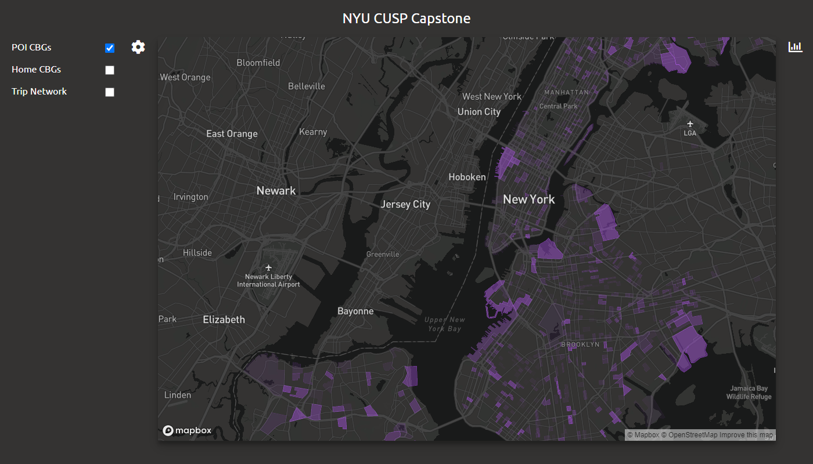

# NYU CUSP Capstone Project



## Installing client

 1. Navigate to the `client/` directory
 2. Create a folder in the directory named `private`.
 3. Add the following JavaScript file inside `private` named `tokens.js`:
 ```
  export const tokens = {
    mapbox: '<INSERT_YOUR_MAPBOX_API_TOKEN_HERE>',
  };
 ```
 4. `npm install`


## Running client

 1. `npm start`
